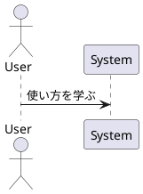
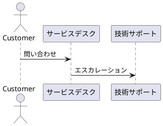
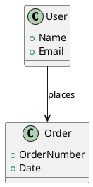

## 1. PlantUML とは

PlantUML は、簡単なテキスト記法を使って UML 図を生成するツールです。シーケンス図
、クラス図、アクティビティ図など、さまざまなダイアグラムを作成できます。

例:



このテキストからシーケンス図が生成されます。

---

## 2. PlantUML の基本記法

### 2.1 シーケンス図

シーケンス図は、システムの処理の流れを表現するのに使用します。

例:



このコードで、顧客が問い合わせを行い、サービスデスクから技術サポートへエスカレー
ションされるシーケンス図を作成できます。

### 2.2 クラス図

クラス図は、システムのクラス構造を表現する際に使用します。

例:



このコードから、`User`クラスと`Order`クラスの関係を示すクラス図が生成されます。

---

## 3. PlantUML のインストール

### 3.1 必要なツール

PlantUML は Java で動作するため、事前に以下のツールをインストールする必要があり
ます。

- **Java**: `java -version` コマンドで Java がインストールされているか確認します
  。
  - インストールされていない場合
    、[Java の公式ページ](https://www.oracle.com/java/technologies/javase-jdk11-downloads.html)か
    らインストールします。
- **Graphviz**: PlantUML でダイアグラムを描画するために必要です。
  - **macOS**では、`brew install graphviz` を実行してインストールします。
  - **Windows**では
    、[Graphviz の公式ページ](https://graphviz.gitlab.io/download/)からダウンロ
    ードし、インストールします。

---

## 4. VSCode で PlantUML を使う

### 4.1 PlantUML 拡張機能のインストール

VSCode で PlantUML を使用するには、以下の手順を実行します。

1. VSCode の左側メニューで「拡張機能」をクリックします。
2. 「PlantUML」を検索し、jebbs による**PlantUML 拡張機能**をインストールします。

### 4.2 プレビューの表示

1. `.puml` または `.plantuml` 拡張子のファイルを作成します。
2. PlantUML のコードを入力します。例:
   ```plantuml
   @startuml
   actor Customer
   Customer -> ServiceDesk: 問い合わせ
   @enduml
   ```
3. `Alt + D` を押して、PlantUML プレビューを表示します。

---

## 5. VSCode での設定とトラブルシューティング

### 5.1 Graphviz の設定

Graphviz が正しくインストールされていない場合、PlantUML はダイアグラムを表示でき
ません。`Graphviz/bin`ディレクトリが環境変数`PATH`に含まれているか確認してくださ
い。

### 5.2 PlantUML サーバーモード

Java や Graphviz をインストールせずに PlantUML を使用したい場合は、PlantUML のサ
ーバーモードを使用することができます。

1. `Alt + Shift + D` を押して、PlantUML のサーバーモードを使用してプレビューしま
   す。

---

## 6. まとめ

PlantUML は、テキストベースで簡単に UML ダイアグラムを作成できる便利なツールです
。VSCode との組み合わせで、シーケンス図やクラス図を効率よく作成し、チームとのコ
ミュニケーションを円滑に進めることができます。Java と Graphviz が必要ですが、サ
ーバーモードを使うことで設定を簡略化できます。
