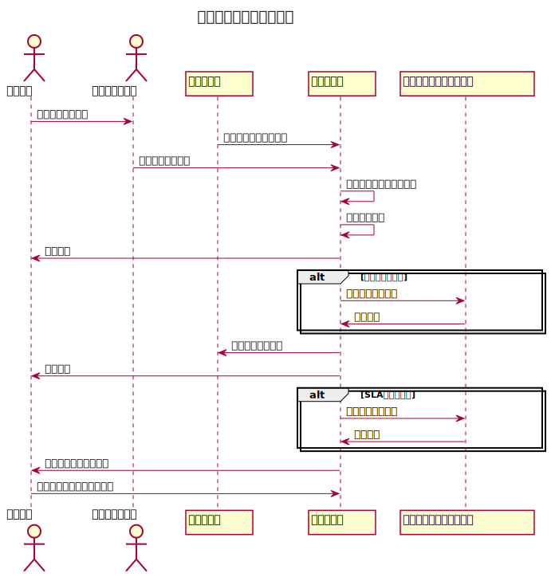

## インシデント発生時の対応フロー

インシデントが発生すると、まずその発生ルートが特定されます。インシデントは大きく
分けて以下の 2 つのルートで発生します：

1. **システムイベント契機**: 監視ツールやシステムが異常を検出した場合に自動的に
   インシデントが作成されます。
2. **ユーザーからの申告契機**: ユーザーが問題を発見し、サービスデスクに申告する
   ことによりインシデントが発生します。

どちらのルートでも、インシデントが発生次第、担当者が問題を特定し、影響範囲や優先
度を評価します。その後、適切な対応策が実行され、問題が解決されるまで状況をモニタ
リングします。ユーザーや関係者への定期的な報告も含め、インシデントの進捗状況が透
明に管理されます。

## インシデント分類と優先度設定

インシデントは、その深刻度と影響範囲に基づいて分類され、優先度が設定されます。分
類の基準としては、以下の要素が含まれます：

- **影響範囲**: システム全体への影響か、一部のユーザーへの限定的な影響か。
- **ビジネスへの影響**: インシデントがビジネス運用にどの程度の影響を及ぼすか。
- **システム依存度**: インシデントが発生したシステムの重要度に基づき、優先度が決
  定されます。

高優先度のインシデントは即時対応が必要であり、緊急チームが対応にあたります。低優
先度のインシデントは、通常の対応プロセスで処理されます。

### 優先度に基づく振り分けルール

- **P1（重大障害）**: インシデント管理チームが即座に対応し、関連チームへエスカレ
  ーション。
- **P2（高優先度）**: 該当チームへ自動振り分け、必要に応じて管理者に通知。
- **P3（中優先度）**: 担当チームに振り分け、通常の対応時間内で対応。
- **P4（低優先度）**: 担当チームに振り分け、低優先度の案件として処理。

インシデントは、その深刻度と影響範囲に基づいて分類され、優先度が設定されます。分
類の基準としては、以下の要素が含まれます：

- **影響範囲**: システム全体への影響か、一部のユーザーへの限定的な影響か。
- **ビジネスへの影響**: インシデントがビジネス運用にどの程度の影響を及ぼすか。
- **システム依存度**: インシデントが発生したシステムの重要度に基づき、優先度が決
  定されます。

高優先度のインシデントは即時対応が必要であり、緊急チームが対応にあたります。低優
先度のインシデントは、通常の対応プロセスで処理されます。

## 自動インシデント作成

インシデントの多くは、監視ツールがシステムの異常を検知した際に自動的に作成されま
す。自動インシデント作成機能により、システムダウンやパフォーマンス低下などが早期
に発見され、対応チームに迅速に通知されます。これにより、手動でのインシデント報告
を待つことなく、即時対応が可能となり、サービスダウンタイムを最小限に抑えます。

### インシデント担当チームの振り分けルール

---

title: インシデント担当チーム決定ルール date: 2024-10-12 description: > サービス
デスクや監視ツールがインシデント発生時に担当チームを決定するためのルール設計。

---

## インシデント担当チーム振り分けルール

### 1. インシデント発生源の特定

インシデントが発生した際には、まずその発生源を特定し、以下のいずれかのルートに従
って対応します。

- **システムイベント契機**: 監視ツールがシステムの異常を検出した場合に自動で作成
  されるインシデント。
- **ユーザー申告契機**: ユーザーがサービスデスクに問題を報告し、作成されるインシ
  デント。

### 2. 担当チーム決定の基本ルール

担当チームは、インシデントの種類、影響範囲、システム依存度、業務優先度に基づき、
次のルールで決定されます。

#### 2.1 システム依存度によるチーム分け

| インシデント種別                 | 担当チーム例                   | 振り分け基準                                       |
| -------------------------------- | ------------------------------ | -------------------------------------------------- |
| **ネットワーク関連の問題**       | ネットワークチーム             | ネットワーク遅延、VPN 接続障害、ルーターダウン     |
| **サーバー関連の問題**           | サーバー管理チーム             | CPU 過負荷、メモリ不足、ストレージエラー           |
| **アプリケーション関連の問題**   | アプリケーションサポートチーム | アプリケーション応答エラー、ログイン障害           |
| **セキュリティ関連の問題**       | セキュリティチーム             | 不正アクセス検知、ファイアウォールアラート         |
| **データベース関連の問題**       | データベース管理チーム         | データベース接続障害、クエリ実行エラー             |
| **エンドユーザー対応関連の問題** | ヘルプデスクチーム             | ユーザーアカウントロック、ソフトウェアインストール |

#### 2.2 影響範囲による振り分け基準

インシデントが発生した際の影響範囲に基づいて、インシデントの優先度と対応チームが
決定されます。

| 影響範囲                                     | 担当チーム例       | 振り分け基準                                             |
| -------------------------------------------- | ------------------ | -------------------------------------------------------- |
| **システム全体への影響**                     | 緊急対応チーム     | システム全体の停止や広範囲のネットワーク障害             |
| **特定部門または一部ユーザーに限定した影響** | 各部門の担当チーム | 特定の部門内でのアプリケーション障害や部門システムダウン |
| **限定的なユーザー影響**                     | 一般対応チーム     | 一部のユーザーが影響を受ける軽微なアプリケーションエラー |

#### 2.3 ビジネス優先度による対応チームの決定

業務運用への影響度に基づいて、以下のように優先度が設定され、担当チームが選定され
ます。

| ビジネスへの影響範囲         | 優先度 | 担当チーム         | 例                                       |
| ---------------------------- | ------ | ------------------ | ---------------------------------------- |
| **クリティカル（全社停止）** | 高     | 緊急対応チーム     | メイン業務システムのダウン               |
| **中程度（部門影響）**       | 中     | 各部門の対応チーム | 特定部門システムの障害                   |
| **軽微（限定的な影響）**     | 低     | 通常対応チーム     | 一部ユーザーにのみ影響があるインシデント |

### 3. 自動振り分けルール

監視ツールやインシデント管理システムが自動的にインシデントを作成する場合、以下の
基準に従って担当チームを自動的に決定します。

1. **システムイベント契機の場合**:

   - 監視ツールが異常を検知した際、システムに依存するインシデントの種類に基づき
     、事前に定義されたチームへインシデントが自動的に割り当てられます（例: ネッ
     トワーク障害はネットワークチームへ、サーバーダウンはサーバー管理チームへ）
     。

2. **ユーザー申告契機の場合**:
   - サービスデスクがインシデントを受け付けた後、ユーザーから報告された問題の種
     類を確認し、インシデント管理システムが問題を自動的に分類して適切なチームに
     振り分けます。

### 4. エスカレーションルール

インシデントが設定された SLA（サービスレベル契約）内に解決されない場合、エスカレ
ーションポリシーに基づき次のチームに引き継がれます。

- **レベル 1 対応**（初期対応チーム）：インシデント発生後すぐに対応。
- **レベル 2 対応**（専門対応チーム）：レベル 1 で解決できない場合にエスカレーシ
  ョン。
- **レベル 3 対応**（管理チーム）：重大なインシデントや長期化した問題が発生した
  場合に最終エスカレーション。

---

このルール設計により、インシデント発生時に迅速かつ効果的に対応チームを決定し、対
応の遅延を防ぐことができます。また、自動化されたインシデント作成機能とエスカレー
ションプロセスによって、適切なリソースが迅速に問題解決に向けられます。

監視ツールによって自動生成されたインシデントは、以下のルールに基づいて担当チーム
に振り分けられます：

- **ネットワーク関連の問題**: ネットワーク管理チームが対応。
- **サーバ関連の問題**: サーバ運用チームに自動振り分け。
- **アプリケーションに関する問題**: アプリケーションサポートチームが担当。

振り分けルールは、インシデントの内容に応じて自動的に適用されます。優先度や影響範
囲も考慮され、必要に応じてエスカレーションされます。

インシデントの多くは、監視ツールがシステムの異常を検知した際に自動的に作成されま
す。自動インシデント作成機能により、システムダウンやパフォーマンス低下などが早期
に発見され、対応チームに迅速に通知されます。これにより、手動でのインシデント報告
を待つことなく、即時対応が可能となり、サービスダウンタイムを最小限に抑えます。

## エスカレーションと対応チームの役割

インシデントが特定の時間内に解決しない場合、エスカレーションが行われます。エスカ
レーションの基準は、SLA（サービスレベルアグリーメント）や影響度に基づいて定めら
れています。

### 担当チームの振り分けルールの概要

- **SLA が厳格な顧客向けのインシデント**: 専任チームに即時振り分け。
- **標準 SLA の顧客向けインシデント**: 通常の対応チームに振り分け。

担当チームの負荷状況やエスカレーション条件に基づき、適切なリソースが配置されます
。また、チーム間での負荷が偏らないように、負荷状況を監視して適宜調整が行われます
。

インシデントが特定の時間内に解決されない場合、エスカレーションポリシーに従って次
のレベルの対応チームに問題が引き継がれます。たとえば、初期対応チームが問題を解決
できない場合、専門技術チームや管理層にエスカレーションされます。このプロセスによ
り、複雑な問題や重大なインシデントが迅速に処理され、問題の長期化が防止されます。

## サービスレベル目標（SLA 対応）

インシデント対応においては、サービスレベル契約（SLA）が重要な役割を果たします
。SLA では、以下の目標が定義されています：

- **初期対応時間**: インシデントが報告されてから、対応チームが初期対応を開始する
  までの時間。
- **解決時間**: インシデントの影響範囲や優先度に応じた解決までの時間。

これにより、ユーザーはインシデント対応がどの程度の時間内で行われるかを予測でき、
サービス品質の維持が保証されます。SLA 違反が発生した場合は、管理チームにエスカレ
ーションされ、対策が講じられます。

## レポートおよび分析

すべてのインシデントは詳細に記録され、定期的にレポートが作成されます。インシデン
トの種類、発生頻度、解決時間などのデータを基に分析を行い、システムの脆弱性や改善
点を特定します。これにより、将来的なインシデントの発生を防ぎ、IT サービスの品質
を向上させることができます。レポートは、月次や四半期ごとに定期的に提出され、経営
層へのフィードバックも含めた改善活動が実施されます。
