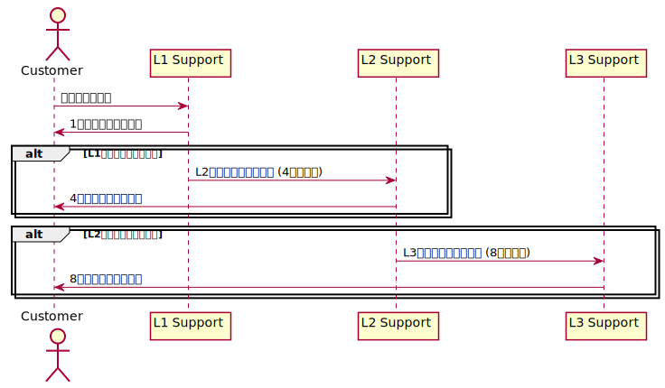

{} このドキュメントでは、サービスデスクに Jira Service Management
を使用する Low-Level Design (LLD) について説明します。 {}

## 1. サポートチャネルの設定

### 1.1 サポートチャネルの種類

- **メールサポート**: support@company.com でのリクエスト受信。
- **電話サポート**: 平日 9:00 - 18:00 に専用サポート回線で対応。
- **チャットサポート**: 社内のチャットツールを使用したリアルタイムサポート。
- **ポータルサポート**: Web ポータルを通じてリクエストを受け付け、トラッキングが
  可能。
- **オンコールサポート**: 重要なインシデントや SLA に基づき、24 時間対応のオンコ
  ールサポートチーム。

### 1.2 サポートチャネルの利用状況

- **標準対応時間**: 平日 9:00 - 18:00
- **緊急対応**: 重大インシデントやシステム停止時のみ 24 時間対応。

---

## 2. エスカレーションポリシー

### 2.1 エスカレーションレベル

- **Level 1 (L1)**: 初期サポート。最初の問い合わせを受け、簡単なトラブルシューテ
  ィングを行い解決可能な場合はその場で対応。解決できない場合は L2 にエスカレーシ
  ョン。

  - **担当者**: サポートスタッフ
  - **対応時間**: 1 時間以内に初回応答

- **Level 2 (L2)**: 複雑な問題やテクニカルな課題に対応するサポート。L1 で対応で
  きない問題を受け取り、技術的な調査や再現テストを実施。必要に応じて L3 にエスカ
  レーション。

  - **担当者**: テクニカルサポートエンジニア
  - **対応時間**: 4 時間以内に初回応答

- **Level 3 (L3)**: L2 で解決できなかった深刻なインシデントや複雑なシステム障害
  に対応。製品開発チームや外部ベンダーとの連携が必要な場合もある。
  - **担当者**: 専門エンジニア、開発チーム
  - **対応時間**: 8 時間以内に対応開始

### 2.2 エスカレーションフロー

1. L1 がリクエストを受信し、問題を解決できない場合は L2 にエスカレーション。
2. L2 が対応し、問題の原因を特定できない場合、L3 にエスカレーション。
3. エスカレーション時には、L1 から L2、L2 から L3 への情報共有が完了していること
   を確認。
4. SLA 違反が発生しそうな場合、上級管理者にエスカレーションし、即時対応を求める
   。

---

## 3. サービスレベル目標 (SLO)

### 3.1 SLO の設定

- **応答時間**: リクエスト受信から 1 時間以内に初回応答を行うことを目標とする。
- **解決時間 (標準)**: 一般的な問題は 4 営業日以内に解決することを目標とする。
- **解決時間 (緊急)**: 緊急のインシデントや重要システム障害は、12 時間以内に解決
  または暫定対応を行うことを目標とする。

### 3.2 SLA 違反時の対策

- **アラートシステム**: SLA 違反が予想される場合、システムが自動的に管理者に通知
  を送り、エスカレーションが実行される。
- **定期レビュー**: SLA が守られているか定期的にレビューし、改善が必要な場合は対
  策を実施。

---

## 4. 機能実装と運用ルール

### 4.1 サポートチャネルの機能実装

- **メールサポート**: メールサーバーとチケット管理システムの統合により、サポート
  メールが自動でトラッキングされる。受信後、1 時間以内に自動返信が送信される。
- **チャットサポート**: チャットボットを導入し、よくある質問を自動で解決。チャッ
  ト履歴はすべてチケットシステムに保存され、エスカレーションが必要な場合は人間の
  サポート担当者が引き継ぐ。
- **オンコールサポート**: オンコール担当者がサポートポータルにログインし、インシ
  デント発生時に迅速に対応できるように設定されている。

### 4.2 エスカレーション管理

- **エスカレーション自動化**: チケットシステムにエスカレーションルールを設定し
  、L1 対応時間が 1 時間を超えると自動で L2 にエスカレーションされる仕組みを実装
  。
- **通知機能**: 各エスカレーションの段階で、担当者およびマネージャーに通知が送信
  され、迅速な対応が促される。
- **エスカレーションポリシーの遵守**: 毎週エスカレーションの状況をレビューし、問
  題の早期解決を図るための改善を行う。

### 4.3 サービスレベル目標 (SLO) の監視

- **モニタリングシステム**: リクエストの応答時間や解決時間をリアルタイムでモニタ
  リングし、SLA 違反を未然に防ぐためのアラートを設定。
- **ダッシュボード**: サービスレベルの達成状況を可視化するダッシュボードを構築し
  、管理者が常に状況を把握できるようにする。

---

## 5. 定期的な運用レビュー

- **週次レビュー**: サポートチームが週次で対応状況や SLA の達成状況をレビューし
  、エスカレーションやリソースの改善を行う。
- **月次 SLA レポート**: 月ごとに SLA の達成率や違反が発生した場合の要因分析を行
  い、改善策を策定。
- **フィードバックループ**: サポートチャネルやエスカレーションポリシーの運用状況
  について、定期的にエンドユーザーからフィードバックを収集し、サービスの改善に活
  かす。

---
